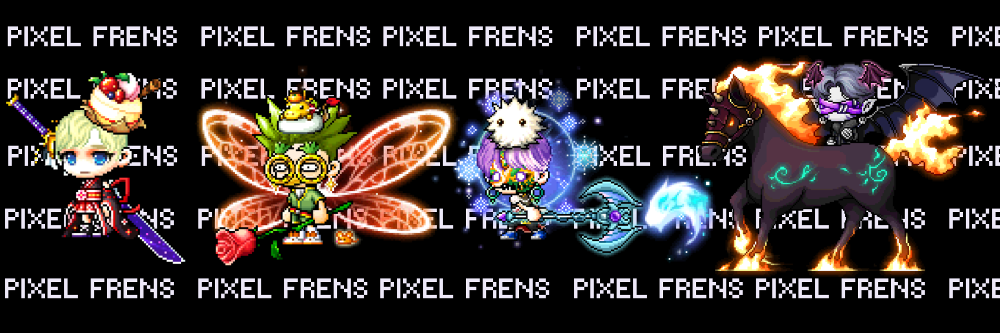

# PixelFrens.github.io
<html>
  <head>
    <meta charset="UTF-8">
    <h2>Pixel Frens</h2>
  </head>
  <body>
    <h1>Welcome to Pixel Frens!</h1>
  </body>
</html>

<button type="button" onclick="connectWallet()">Connect Wallet</button>
    <form>
      <label for="tokenId">Token ID:</label>
      <input type="text" id="tokenId" name="tokenId">  
      <button type="button" onclick="mintNFT()">Mint NFT</button>
    

   